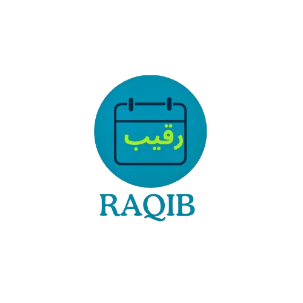
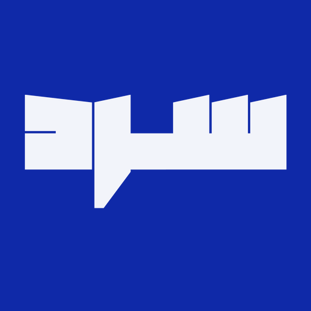
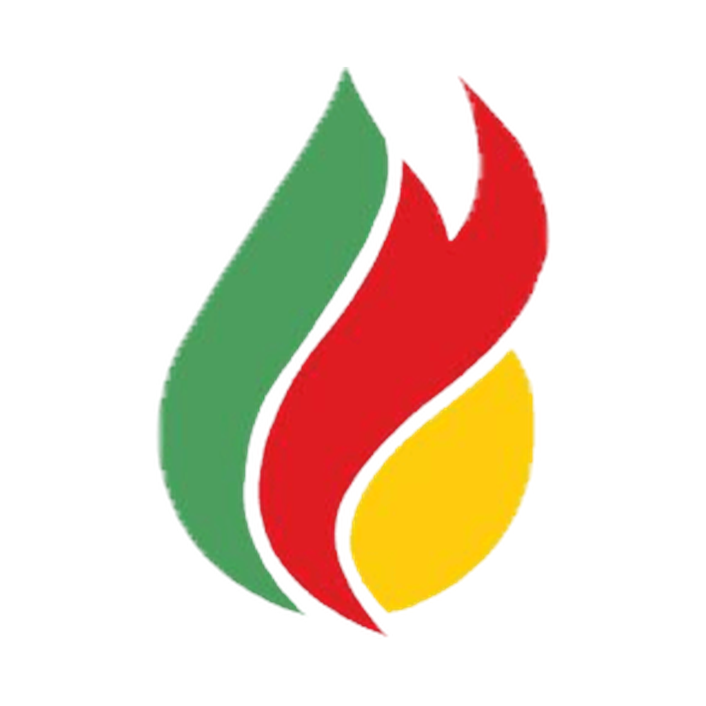

<div align="center">

<!-- HEADER -->
<h1>
  
  Mohammed Hassen
</h1>

<h3>Full-Stack & Mobile Developer · AI Dev · Network Enthusiast</h3>

<!-- TYPING -->

[](https://git.io/typing-svg)

<!-- SOCIAL -->
<br/>

<a href="https://linkedin.com/in/mohamed-douiery-a48496373"></a>
<a href="mailto:mohasseenn@gmail.com"></a>
<a href="https://www.credly.com/users/mohamed-hassen.48caab32"></a>
<a href="https://github.com/7assen-coder"></a>

<br/><br/>


</div>

---

<br/>

<table>
<tr>
<td width="50%" valign="top">

### `> whoami`

```yaml
name: Mohammed Hassen
location: Nouakchott, Mauritania
education: ESP — Ecole Superieure Polytechnique
role: Full-Stack & Mobile Developer

active_projects:
  - RAGHIB   → Attendance + Face Recognition
  - Lebne    → Conversational AI for E-Wallet
  - ACPEC    → Odoo Gas Management Platform
  - ESPAIDE  → Solidarity Platform (Next.js)

domains:
  - AI / Computer Vision / NLP
  - Cybersecurity & Networking
  - SaaS & ERP (Odoo)
  - Cross-Platform Mobile
  - Cloud & DevOps
```

</td>
<td width="50%" valign="top">

### `> certifications --verified`

<br/>

<div align="center">

<a href="https://www.credly.com/badges/78dd61c6-331d-4714-bc35-84afe8af4cc6"></a>
&nbsp;&nbsp;&nbsp;&nbsp;
<a href="https://www.credly.com/badges/b295181d-6457-4784-bc57-c83d8e1b00a1"></a>

**Introduction to Cybersecurity** &nbsp;|&nbsp; **Networking Basics**

<sub>Cisco Networking Academy · Verified Jun 2026</sub>

<br/>

<a href="https://www.credly.com/users/mohamed-hassen.48caab32"></a>

</div>

</td>
</tr>
</table>

---

### Tech Arsenal

<div align="center">

**`Backend`**


**`Frontend`**


**`Mobile`**


**`AI & Data`**


**`Databases & Infrastructure`**


**`Security & Networking`**


**`Other Languages`**


</div>

---

### Projects I Built

<table>
<tr>
<td width="50%" valign="top">

<p align="center">
  <a href="https://github.com/7assen-coder/RAGHIB"></a>
</p>
<h3 align="center"><a href="https://github.com/7assen-coder/RAGHIB">RAGHIB</a></h3>
<p align="center"><code>Intelligent Attendance System</code></p>

<p align="center">
  
  
  
  
  
</p>

> Full-stack attendance platform with **face recognition**, WiFi-based location verification, role-based dashboards (Admin / Responsable / User), Celery + Redis async pipeline, real-time notifications, and military announcements module.

</td>
<td width="50%" valign="top">

<p align="center">
  <a href="https://github.com/7assen-coder/Lebne"></a>
</p>
<h3 align="center"><a href="https://github.com/7assen-coder/Lebne">Lebne</a></h3>
<p align="center"><code>Conversational AI Agent — E-Wallet</code></p>

<p align="center">
  
  
  
  
</p>

> Multilingual AI agent (Arabic, French, English) for a Mauritanian e-wallet. Expense extraction, FAQ/RAG, gated account actions. LangGraph orchestration, QLoRA fine-tuning on Qwen2.5, Qdrant vector search.

</td>
</tr>
<tr>
<td width="50%" valign="top">

<p align="center">
  <a href="https://github.com/7assen-coder/ESPAIDE"></a>
</p>
<h3 align="center"><a href="https://github.com/7assen-coder/ESPAIDE">ESPAIDE</a></h3>
<p align="center"><code>Solidarity & Charity Platform</code></p>

<p align="center">
  
  
  
  
</p>

> ESP association platform — campaigns, events, aid stories, help requests. Hidden admin CMS with secret-path auth. Full CI/CD via GitHub Actions. Supabase (Postgres, Auth, Storage).

</td>
<td width="50%" valign="top">

<p align="center">
  <a href="https://github.com/7assen-coder/sard-news"></a>
</p>
<h3 align="center"><a href="https://github.com/7assen-coder/sard-news">Sard News</a></h3>
<p align="center"><code>Mauritanian News Platform</code></p>

<p align="center">
  
  
  
  
</p>

> Full-stack multilingual news platform (Arabic RTL, French, English). Hidden admin CMS, scheduled publishing, analytics, SEO (sitemap, RSS, JSON-LD), newsletter, full-text search.

</td>
</tr>
<tr>
<td width="50%" valign="top">

<p align="center">
  <a href="https://github.com/7assen-coder/ACPeC-Sarl"></a>
</p>
<h3 align="center"><a href="https://github.com/7assen-coder/ACPeC-Sarl">FuelToken</a></h3>
<p align="center"><code>Traceable Fuel Voucher App</code></p>

<p align="center">
  
  
  
</p>

> Flutter app for traceable fuel voucher management — purchase lots, QR issuance, station consumption. Integrates Odoo 18 via JSON-RPC, role-based access (user/admin/station).

</td>
<td width="50%" valign="top">

<p align="center">
  <a href="https://github.com/7assen-coder/mauritania-culture"></a>
</p>
<h3 align="center">
  <a href="https://github.com/7assen-coder/portfolio">Portfolio</a> · <a href="https://github.com/7assen-coder/mauritania-culture">Culture</a>
</h3>
<p align="center"><code>Personal & Cultural Websites</code></p>

<p align="center">
  
  
  
</p>

> **Portfolio** — Personal developer showcase (Next.js + TypeScript). **Mauritania Culture** — Interactive cultural heritage site for ESP Cultural Day.

</td>
</tr>
</table>

---

### Open-Source Contributions

<table>
<tr>
<td width="33%" align="center">

**ACPEC Gas Platform**

<a href="https://github.com/Zaki3284/ACPEC-Gas-Platform-PE"></a>
<a href="https://github.com/Zaki3284/ACPEC-Gas-Platform-FE"></a>


<sub>Gas management — Odoo backend modules + Flutter mobile app</sub>

</td>
<td width="33%" align="center">

**Scolarite Militaire**

<a href="https://github.com/fatimetou80/ScolariteMilitaireFront"></a>


<sub>Military school management — React frontend</sub>

</td>
<td width="33%" align="center">

**ESP Management**

<a href="https://github.com/Bouhe-Moustapa/esp_management"></a>


<sub>Student management app for ESP</sub>

</td>
</tr>
</table>

---

### Research Interests

<div align="center">

| | Field | Focus |
|:---:|:---|:---|
| :eye: | **Computer Vision** | Face Recognition, Biometric Systems |
| :robot: | **NLP & LLMs** | Multilingual Agents, RAG, Arabic NLP, QLoRA |
| :shield: | **Cybersecurity** | Network Security, SIEM (Splunk), Threat Monitoring |
| :satellite: | **IoT & Smart Systems** | WiFi Indoor Positioning, Automated Verification |
| :building_construction: | **SaaS & ERP** | Multi-tenant Platforms, Odoo, Microservices |
| :bar_chart: | **Data Science** | Analytics Dashboards, Datathon Competitions |
| :whale: | **DevOps** | CI/CD Pipelines, Docker, Cloud Deployment |

</div>

---

### GitHub Stats

<div align="center">


<br/><br/>


<br/><br/>


&nbsp;

&nbsp;


</div>

---

<div align="center">

<br/>

<sub>Open to collaboration, internships, and new opportunities</sub>

</div>
